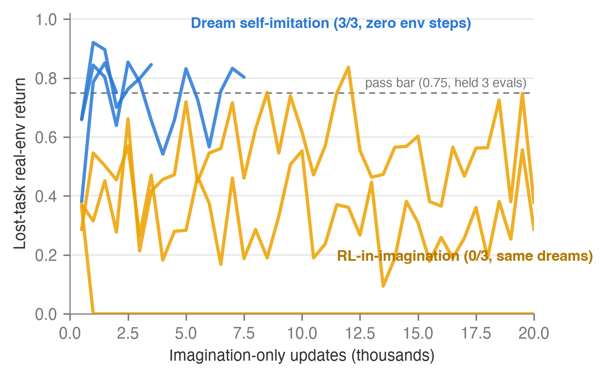
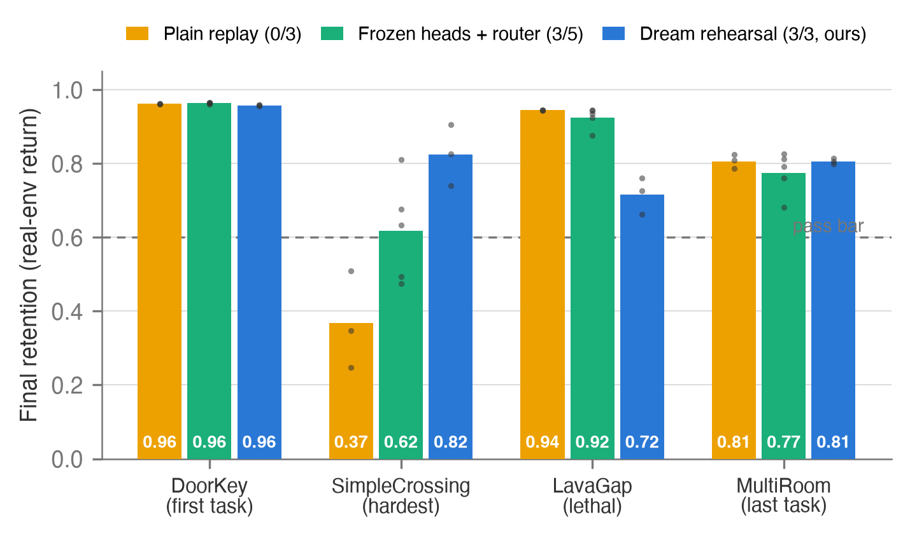

# The World Model Remembers, the Actor Forgets

### Dream Rehearsal for Continual Model-Based RL

[](https://arxiv.org/abs/2607.19749)
[](https://zenodo.org/badge/latestdoi/1307022956)
[](LICENSE)

**When a reinforcement-learning agent "catastrophically forgets" a skill, we measured which
part actually forgot. The answer: none of the memory.** The world model retains everything —
reward structure, values, dynamics. Only the *behavior* decays. And a lost skill can be
restored by having the agent imitate its own graded dreams, with **zero new environment
interaction**.

<p align="center">
  <br>
  <sub><b>The recovery race.</b> Same frozen world model, same imagined data, two teachers.
  Reinforcement learning in imagination (orange) fails on 3/3 seeds. Supervised imitation of
  the model's own graded dreams (blue) recovers the lost skill on 3/3 — without touching the
  environment. <i>The learning channel is what's broken, not the memory.</i></sub>
</p>

## Results

**Four-task chains** (DoorKey-5x5 → SimpleCrossing → LavaGap → MultiRoom), n=3 seeds:

| | Plain replay | Frozen heads + router | **Dream rehearsal** |
|---|---|---|---|
| Chains retained (all 4 tasks ≥ 0.6) | 0 / 3 | 3 / 5 | **3 / 3** |
| Hardest-task retention | 0.37 | 0.62 ± 0.13 | **0.82** |
| Task labels needed | no | no | **no** |
| Extra parameters | none | +1 policy per task | **none** |

**Eight-task chains** — same recipe, same constants, double the length.
**All three seeds retain all eight tasks** (pass bar 0.6 on every task; per-seed final
retention):

| Seed | DoorKey5 | SimpleX | LavaGap | MultiRoom | LavaCross | DistShift | DoorKey6 | Unlock |
|---|---|---|---|---|---|---|---|---|
| 1 | 0.964 | 0.943 | 0.947 | 0.759 | 0.861 | 0.960 | 0.915 | 0.861 |
| 2 | 0.963 | 0.919 | 0.943 | 0.746 | 0.865 | 0.929 | 0.962 | 0.888 |
| 3 | 0.901 | 0.876 | 0.942 | 0.754 | 0.794 | 0.959 | 0.962 | 0.740 |

By the final phase the agent runs 350 dream-imitation updates per 2,000-step chunk across
seven prior tasks — still one actor, still no task labels, still no added parameters. The
baselines were not run at eight tasks: plain replay already fails at four, so the comparison
was made where it is informative (raw per-run data for every run above is in
[`results/`](results/)).

Dream rehearsal also outperforms matched real-episode cloning (paired difference **+0.13**,
bootstrap 95% CI [0.07, 0.24], every dream seed above every cloning seed) — §6.2 of the paper
gives the pre-registered comparison, including the bug we caught *in our own favour* and killed
before reading any verdict.

<p align="center">
  <br>
  <sub>Final retention across the four-task chain; per-seed points over bar means.</sub>
</p>

## How it works

Every 2,000 environment steps, while learning a new task, the agent:

1. **imagines** rollouts from prior-task states with its current policy,
2. **grades** each imagined trajectory using its own world model — realized-first: dreams that
   *actually achieved* reward outrank dreams that merely promise it,
3. **imitates** the top 25%.

One actor throughout. No task labels at any point, no stored policies, no router, no parameter
growth, ~15% compute overhead. The grading step is where the difficulty lives — get it wrong
and the agent imitates walking into lava (§7 characterizes two ways that happens, and ships the
offline gauge that catches them before they cost training time).

## What's in this repo

| | |
|---|---|
| [`paper/`](paper/) | The paper (PDF + LaTeX source) and figures |
| [`src/`](src/) | Orchestrators, probes, the offline selection gauge, sweep scripts |
| [`prereg/`](prereg/) | **The full pre-registration trail** — every protocol, bar, and interpretation matrix, committed before its experiment ran, including refuted hypotheses and both scoring bugs |
| [`results/`](results/) | **31 runs** — per-run summaries and complete evaluation traces for every experiment in the paper (see [`results/README.md`](results/README.md) for the run-to-section map) |
| [`substrate/`](substrate/) | Environment wrapper + setup notes |

**Every experiment was pre-registered before it ran.** Bars, arms, and interpretation matrices
were committed to version control first; refuted hypotheses appear in the main text, not in a
footnote. Total compute: one NVIDIA GB10 workstation, roughly three weeks.

## Reproduce

Runs on [NM512/dreamerv3-torch](https://github.com/NM512/dreamerv3-torch) — see
[`substrate/SETUP.md`](substrate/SETUP.md) for the three-step install, then:

```bash
python orchestrator_chain_nm512.py \
  --tasks minigrid_DoorKey-5x5,minigrid_SimpleCrossingS9N1,minigrid_LavaGapS5,minigrid_MultiRoom-N2-S4 \
  --tunnel_rehearsal --cont_grading --rehearsal_updates 50 \
  --eval_every 2000 --phase_max_steps 150000 --logdir ./tunl4b_s1 --seed 1
```

## Citation

```bibtex
@article{nijjer2026dreamrehearsal,
  title={The World Model Remembers, the Actor Forgets: Dream Rehearsal for Continual Model-Based RL},
  author={Nijjer, Gurp},
  year={2026},
  eprint={2607.19749},
  archivePrefix={arXiv},
  primaryClass={cs.LG},
  doi={10.5281/zenodo.21462836},
  note={https://github.com/gurpnijjer/dream-rehearsal}
}
```

---

**Gurp Nijjer** — [Quantegra Research](https://quantegra.ca) · Apache-2.0 ·
[paper](https://arxiv.org/abs/2607.19749) · [archive](https://doi.org/10.5281/zenodo.21462836)
